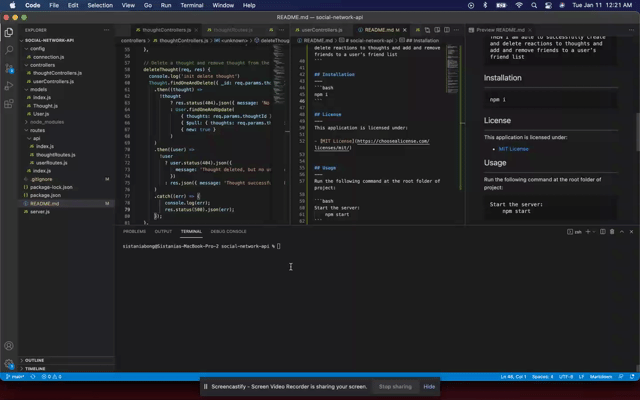

# social-network-api

## Description
--------------
This repo consists of backend server for a social network web application. This application uses Node.js, Express, MongoDB database and Mongoose ODM.


## Table of Contents

- [Description](#description)
- [User Story](#user-story)
- [Acceptance Criteria](#acceptance-criteria)
- [Installation](#installation)
- [License](#license)
- [Usage](#usage)
- [Contributing](#contributing)
- [Review](#review)
- [Mock Up](#mock-up)
- [Questions](#questions)


## User Story
```md
AS A social media startup
I WANT an API for my social network that uses a NoSQL database
SO THAT my website can handle large amounts of unstructured data
```

## Acceptance Criteria
```md
GIVEN a social network API
WHEN I enter the command to invoke the application
THEN my server is started and the Mongoose models are synced to the MongoDB database
WHEN I open API GET routes in Insomnia for users and thoughts
THEN the data for each of these routes is displayed in a formatted JSON
WHEN I test API POST, PUT, and DELETE routes in Insomnia
THEN I am able to successfully create, update, and delete users and thoughts in my database
WHEN I test API POST and DELETE routes in Insomnia
THEN I am able to successfully create and delete reactions to thoughts and add and remove friends to a user’s friend list
```

## Installation
---
```bash
npm i
```

## License
---
This application is licensed under:

- [MIT License](https://choosealicense.com/licenses/mit/)


## Usage
---
Run the following command at the root folder of project:

```bash
Start the server:
    npm start
```

The following GIF displays the app's setup:



## Contributing
---
Pull requests are welcome. For major changes, please open an issue first to discuss what you would like to change.

## Review
---
To review the code, please go to the [repository](https://github.com/sistaniabong/https://github.com/sistaniabong/social-network-api)


## Mock Up
---
Please see below links to see demo videos that show the app's functionality:

- GET All Users, GET a User, UPDATE a User, DELETE a User, POST a User
https://watch.screencastify.com/v/xbLO6sLl890Z35V6P5cz

- GET All Thoughts, GET a Thought, UPDATE a Thought, DELETE a Thought, POST a Thought
https://watch.screencastify.com/v/PCvQ4lFIeLpBQwbcINRx

- POST a friend to a user & DELETE a friend from the user's friends list
https://watch.screencastify.com/v/viADyiu9ai6cJIK3Tot1

- POST a reaction to a thought & DELETE a reaction from the thought's reaction list
https://watch.screencastify.com/v/TNStCtekzbOt6XbgqT5L

- Application deletes a user's associated thoughts when the user is deleted
https://watch.screencastify.com/v/2ANSbxlCgLJMTj2RDRPa


## Questions
---
If you have any questions, please feel free to check out my github account and email me at the email address below:

Github account: [sistaniabong](https://github.com/sistaniabong)

Email address: sistaniawibonele@gmail.com